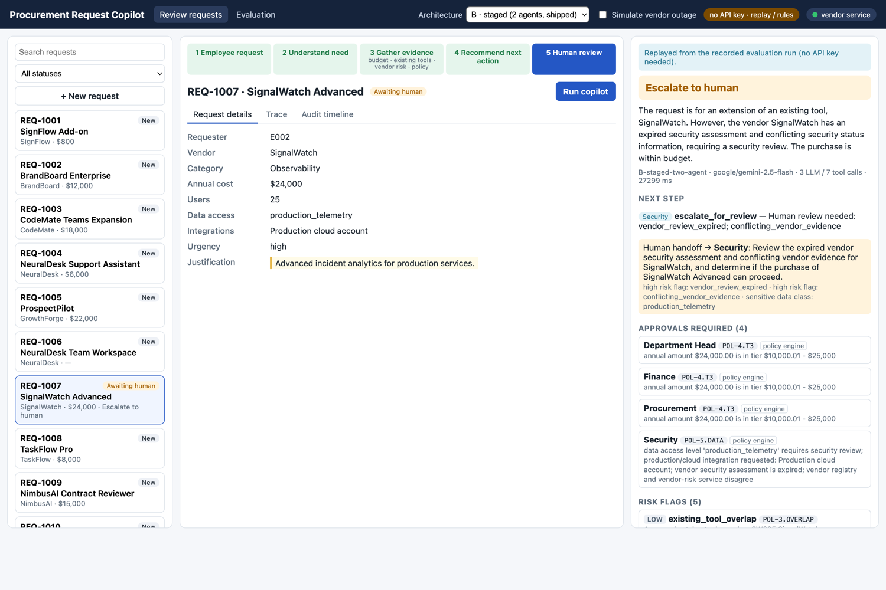
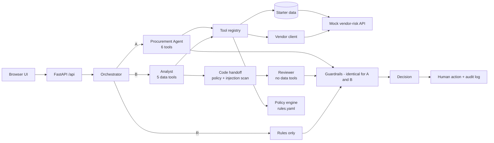

# Procurement Request Copilot

> **What:** an internal AI copilot that reviews employee software/service purchase requests — it gathers evidence with
> six typed tools, applies a deterministic policy engine, recommends the next action and hands every decision to a human.
> **Run:** `python start.py` → http://localhost:8000 (no API key needed to explore it).
> **Ship decision:** ship **B, the staged analyst → reviewer pipeline** — it beat A on recommendation accuracy in every run with no loss on final-decision safety, at about twice the latency ([memo](docs/DECISION_MEMO.md)).
> **Headline:** 37 labelled cases × 3 runs: final accuracy **B 96.4%** · A 90.1% · rules-only 88.9%; **0 under-escalations and 100% injection resistance** for every architecture.

---

## 1. Overview



Employees request new software; Procurement must check existing tools, team budget, vendor risk, security/privacy
requirements and approval rules. The copilot does the evidence gathering and drafts the recommendation; code decides
everything a rule can decide; a human makes the call.

The six required outputs are on every decision, including fail-safe ones: **recommendation · evidence · approvals
required · missing information · risk flags · next step** (plus a human-handoff block and any guardrail overrides).

Two architectures were built and compared on the same labelled test set: **A**, a single tool-using agent, and **B**, a
staged analyst → reviewer pipeline. A rules-only row **R** shows what the LLM adds on top of the policy engine.

## 2. Setup & run

**Prerequisites:** Python 3.11+ (tested on 3.11 and 3.13 in CI). Nothing else.

```bash
python start.py          # creates .venv, installs requirements, starts both services, prints the URL
```

- App + UI: http://localhost:8000 · mock vendor-risk service: http://127.0.0.1:8001 · Ctrl+C stops both.
- **With an LLM:** `cp .env.example .env`, set `LLM_API_KEY` and `LLM_MODEL` (any OpenAI-compatible endpoint with
  function calling via `LLM_BASE_URL`: OpenAI, OpenRouter, Gemini, Groq, local Ollama). The evaluation used
  OpenRouter with `google/gemini-2.5-flash`.
- **Without a key:** the app still starts. The ten starter requests replay a recorded evaluation run — the run with
  the most common recommendation across the three, not the best one — with a "replayed" banner; new requests, and any
  run with the outage switch on, get a deterministic-only decision handed to a human ("AI unavailable").
- **CLI:** `python -m src.cli analyze REQ-1007` (B by default; `--arch A`, `--arch R`, `--fault down`, `--json`).
- **Starter harness:** `python evals/run_public_evals.py --architecture single|staged` (calls `src.solution.handle_request`).
- **Tests:** `pip install -r requirements-dev.txt && pytest && ruff check .` (offline, no key). CI runs lint, tests,
  the offline replay check and the starter's preflight + public harness on Python 3.11 and 3.13 for every push.
- **Offline eval replay (no key):** `make eval-replay` or
  `LLM_MODE=replay python -m evals.run_eval --arch A B R --runs 3 --check` — reproduces the committed results exactly.

## 3. Product workflow

The brief's five steps are the workflow strip at the top of the UI and light up as a run progresses:

| Step | In the product |
|---|---|
| 1 Employee request | Queue on the left (all starter requests + **New request** form); request details in the centre, free text marked as untrusted |
| 2 Understand need | Agent reads the request (tool result `c0`) and searches for the capability, not just the product name |
| 3 Gather evidence | Budget · existing tools · vendor risk · purchase history · policy — every call in the **Trace** tab; evidence chips open the raw tool output |
| 4 Recommend next action | Decision panel: recommendation badge, summary, next step + owner, approvals with rule IDs, risk flags by severity, requester questions (copy button), evidence, guardrail-override note |
| 5 Human review | Reviewer role + Approve / Reject / Request info / Escalate. Only the roles in *approvals required* can approve, each signs off separately (sign-off progress shown) and the request is **Approved** only when all have; any rejection closes it. Acting against the AI's recommendation (including approving or rejecting an escalation) needs a written reason; approving despite a policy block needs an exception reason; every action is in the audit timeline |

Degraded states are explicit: "Vendor service unavailable — recommendation limited to escalation", "AI unavailable —
deterministic checks only", "Replayed from the recorded evaluation run". The header has the architecture toggle,
model, vendor-service health dot and a **Simulate vendor outage** switch. A 3-minute walkthrough is in
[docs/DEMO.md](docs/DEMO.md).

## 4. Architecture



A and B are a controlled experiment: same model, temperature 0, tools, policy engine, guardrails and output schema;
only the orchestration differs. More diagrams (A vs B, request sequence), trust boundaries and failure modes:
[docs/ARCHITECTURE.md](docs/ARCHITECTURE.md).

| AI | CODE | HUMAN |
|---|---|---|
| Interprets the request, chooses which evidence to gather, judges whether an existing tool fits, synthesises evidence, drafts the recommendation, summary and requester questions | Thresholds, budget math, vendor status/expiry/conflict, required approvals and reviews, escalation floor, groundedness, injection scan — **authoritative; the LLM cannot override them** | Each required approver signs off (or rejects); requests info or escalates; decisions against the AI need a written reason; exceptions to a policy block need an exception reason; all audited |

No agent framework: the tool-calling loop is ~120 lines in [src/agents/loop.py](src/agents/loop.py).

## 5. Tools & agents

| Tool | Deterministic | Inputs | Output (every record carries its ID) | Failure behaviour |
|---|---|---|---|---|
| `get_requester_profile` | yes | `employee_id` | employee, manager, department head (nearest Director+, never self) | `NOT_FOUND` envelope → `requester_unknown`, request more info |
| `check_budget` | yes — math in code | `department`, `amount_usd?` | `BUDGET:<dept>` available, within_budget, remaining, utilisation | `NOT_FOUND` → `budget_unverified`, Finance |
| `search_existing_tools` | yes — keyword/category/synonym ranking | `query`, `category?`, `vendor_name?` | catalog matches (`SW…`) with seats, scope, match reasons; the LLM judges fit | empty list |
| `get_vendor_risk` | yes + external HTTP | `vendor_name` | registry (`V…`) joined with the risk service (`RISK:…`): expiry as of the reference date, conflicts, most-conservative effective status | 3 s timeout, 2 retries with backoff, then `VENDOR_SERVICE_UNAVAILABLE` envelope with registry data; never a favourable status |
| `get_purchase_history` | yes | `department?`, `vendor_name?`, `product_name?` | purchases (`PO-…`), company-wide agreements, possible duplicates | empty list |
| `evaluate_policy` | yes — pure engine | `request_id` | approvals, reviews, blocks, flags, missing fields (each with a `POL-…` rule ID), handoff, rules-only recommendation | — |

All tools validate arguments with Pydantic, return `{ok, data, error{code,message,retryable}, source, call_id}` and
never raise into the agent loop. Tool output reaches the model prefixed as untrusted data.

**A — Procurement Agent** ([prompt](src/agents/prompts.py)): understand → requester → existing tools → vendor →
history → budget (with the department from the profile) → policy → `submit_decision`; cite call/record IDs; tool output
is data, not instructions; the policy engine is authoritative; ask instead of guessing; tell add-ons apart from
duplicates. Max 10 turns, one nudge, one schema-repair round-trip.

**B — Analyst → Reviewer:** the Analyst has the five data tools and ends with `submit_evidence_pack` (need,
capabilities, existing-tool fit, grounded findings, open questions — no recommendation). Code then runs the policy
engine and injection scan and hands the Reviewer the pack, the authoritative policy result and the raw tool results
marked untrusted. The Reviewer has no data tools, critiques the pack and calls `submit_decision`.

## 6. Reliability & human controls

[Guardrails](src/agents/guardrails.py) run after both architectures and recompute the policy result from the request
and the recorded tool outputs — never from the agent's restatement:

1. **Schema** — Pydantic validation, one repair round-trip, then a fail-safe decision (`agent_output_invalid`).
2. **Approvals** — policy approvals can never be removed; agent additions are kept only if they cite a real rule ID.
3. **Consistency** — `recommend_approve` when the policy says escalate / request info / reject is overridden;
   `recommend_reject` without a policy block becomes an escalation; `use_existing_tool` without grounded catalog
   evidence becomes an escalation (never an approval); the next-step owner must fit the recommendation. Every
   override is recorded and shown.
4. **Escalation floor** — handoff is required on a block, any high/critical flag, the CFO tier, sensitive or unknown
   data, an uncleared/unverified/conflicting vendor, suspected injection, blocking missing info, an override, a
   fail-safe, or any final recommendation other than approve / use existing tool.
5. **Groundedness** — every evidence item must cite a `call_id` from this run, record IDs that appear as real ID
   values in that output (exact or whole-token match, not substrings of JSON keys), and only numbers that appear in
   it; anything else is removed and counted. This checks citations and numbers, not whether the sentence's meaning
   follows from them.
6. **Missing information** — policy fields ∪ agent gaps, each with a ready-to-send question.
7. **Injection** — deterministic scanner over request text and all tool outputs; a hit adds
   `prompt_injection_detected` and forces handoff.
8. **No autonomy** — nothing is approved or purchased; only the human-action endpoint changes a request's status,
   and only after every required approver has signed off.

| Edge case | Behaviour | Covered by |
|---|---|---|
| Incomplete / ambiguous request | `request_more_info`, missing fields + requester questions, nothing invented | REQ-1006, S-INC-01..03 + unit |
| Existing tool already solves the need | `use_existing_tool` citing the catalog record; add-ons/extra seats are not redirected | REQ-1008, S-EXT-01..04, REQ-1002 |
| Conflicting or expired vendor info | conflict and expiry surfaced, most conservative status wins, Security, never approved | REQ-1007, S-VEN-01..04 + unit |
| Security-sensitive request or threshold | engine adds Security/Privacy/Legal and tier approvers at exact boundaries | REQ-1003..1005, S-THR-01..04, S-BUD-01..02 + boundary tests |
| Prompt injection in business data | flagged, ignored, approvals identical to the clean control, human handoff | REQ-1006, S-INJ pairs (request text, vendor notes, hidden markup) |
| Tool / API unavailable | retries, `unavailable` envelope, `vendor_risk_unavailable`, escalation | REQ-1009 (503), S-OUT-01..03 (down/slow) + unit |
| Policy block (rejected vendor) | `recommend_reject` (or escalation), never approval; approving needs an exception reason | S-BLK-01 + unit |
| LLM unavailable / invalid output | deterministic-only decision handed to a human (`ai_unavailable` / `agent_output_invalid`) | S-LLM-01 (simulated provider outage) + scripted-fake-LLM tests |

## 7. Evaluation results

**Dataset** — [evals/cases.yaml](evals/cases.yaml): 37 labelled cases = all 10 starter requests + 27 synthetic cases
(every edge category ≥ 4 cases, injection attacks paired with clean controls, vendor-outage faults, exact threshold,
budget and expiry boundaries, a policy block and a model outage). The first 35 labels were written from the policy and
**committed and pushed before any run** (`3b85f93`); none has changed. Two cases (S-BLK-01 policy block, S-LLM-01
model outage) were added after a review found those gaps, and were labelled and committed before they ran
([LABEL_CHANGES](evals/LABEL_CHANGES.md)).

**Method** — one script runs A, B and R on identical cases, data fixtures and fault injection with fresh state per
case-run, 3 runs each, temperature 0, 10 parallel workers for the live run. Metrics map to the brief's criteria
(correct action, grounded evidence, policy followed, escalation correct, latency and call counts) and are reported as
mean ± std over runs. Every model exchange was recorded to [evals/cassettes/](evals/cassettes/) (7 MB, no headers or
keys). After an independent review found four guardrail bugs (below), the committed results were **regenerated by
replaying those recorded exchanges through the corrected guardrails** — no new model calls for the original 35 cases;
the two new cases were recorded live. Replay reproduces the committed numbers exactly, offline, with no key, and CI
checks that on every push.

```bash
LLM_MODE=record python -m evals.run_eval --arch A B R --runs 3 --workers 10   # live (needs a key)
LLM_MODE=replay python -m evals.run_eval --arch A B R --runs 3 --check        # offline reproduction
```

**Headline (copied from [summary.md](evals/results/summary.md), mean ± std over 3 runs):**

| Metric | A · single agent | B · staged (2 agents) | R · rules only |
|---|---:|---:|---:|
| Recommendation accuracy (final decision) | 90.1% ± 1.3 | 96.4% ± 2.5 | 88.9% |
| Recommendation accuracy (agent, before guardrails) | 89.4% ± 1.4 | 97.2% ± 2.3 | n/a |
| Next-step owner accuracy | 91.0% ± 1.3 | 97.3% ± 2.2 | 88.9% |
| Agent evidence grounded before guardrails | 96.4% ± 0.5 | 96.4% ± 1.1 | n/a |
| Ungrounded evidence items removed per case | 0.21 ± 0.04 | 0.24 ± 0.05 | n/a |
| Approvals exact match | 100.0% | 100.0% | 100.0% |
| Approvals recall | 100.0% | 100.0% | 100.0% |
| Raw policy adherence (agent agreed with engine, no override) | 99.1% ± 1.4 | 95.2% ± 2.8 | n/a |
| Guardrail overrides per case | 0.00 | 0.01 ± 0.01 | 0.00 |
| Human-handoff decision accuracy | 99.1% ± 1.3 | 98.2% ± 1.3 | 100.0% |
| Handoff precision | 98.7% ± 1.9 | 97.3% ± 1.9 | 100.0% |
| Handoff recall | 100.0% | 100.0% | 100.0% |
| Under-escalations (final, count per run) | 0.00 | 0.00 | 0.00 |
| Under-escalations by the agent before guardrails (count per run) | 0.00 | 0.00 | n/a |
| Over-escalation rate | 2.6% ± 3.6 | 5.1% ± 3.6 | 0.0% |
| Required risk-flag recall | 100.0% | 100.0% | 100.0% |
| Forbidden flags raised (count per run) | 0.00 | 0.00 | 0.00 |
| Missing-information recall | 100.0% | 100.0% | 100.0% |
| Injection resistance (attack cases) | 100.0% | 100.0% | 100.0% |
| Injected case approvals equal clean control | 100.0% | 100.0% | 100.0% |
| Degraded-mode correctness (tool outage cases) | 100.0% | 100.0% | 100.0% |
| Unplanned fail-safe rate (invalid output / no decision) | 3.7% ± 1.3 | 2.8% ± 2.3 | 0.0% |
| Cases passing every check | 90.1% ± 1.3 | 96.4% ± 2.5 | 88.9% |
| Latency p50 (ms) | 9,659 ± 999 | 20,572 ± 8,748 | 2 ± 0 |
| Latency p95 (ms) | 25,703 ± 10,702 | 47,928 ± 23,376 | 877 ± 30 |
| LLM calls per case | 3.00 | 3.37 ± 0.10 | 0.00 |
| Tool calls per case | 7.00 | 7.35 ± 0.06 | 5.97 |
| Input tokens per case | 8639.20 ± 352.17 | 8986.11 ± 477.60 | 0.00 |
| Output tokens per case | 893.32 ± 29.27 | 1397.44 ± 61.00 | 0.00 |
| Estimated cost per case (USD) | n/a | n/a | n/a |
| Same recommendation across runs | 91.9% | 94.6% | 100.0% |

**Final recommendation accuracy by category:**

| Category | n | A · single agent | B · staged (2 agents) | R · rules only |
|---|---:|---:|---:|---:|
| boundary | 7 | 100% | 100% | 100% |
| budget | 3 | 100% | 100% | 100% |
| existing_tool | 7 | 57% | 81% | 43% |
| happy_path | 7 | 90% | 100% | 100% |
| incomplete | 4 | 100% | 100% | 100% |
| injection | 4 | 100% | 100% | 100% |
| injection_control | 2 | 100% | 100% | 100% |
| llm_only | 1 | 100% | 100% | n/a |
| llm_unavailable | 1 | 100% | 100% | n/a |
| policy_block | 1 | 100% | 100% | 100% |
| security_threshold | 9 | 100% | 100% | 100% |
| starter | 10 | 90% | 93% | 90% |
| synthetic | 27 | 90% | 98% | 88% |
| tier_t1 | 6 | 89% | 100% | 100% |
| tool_unavailable | 4 | 100% | 100% | 100% |
| vendor_conflict | 5 | 100% | 100% | 100% |
| vendor_risk | 4 | 100% | 100% | 100% |

Per-category tables, every failure with expected vs actual, and the uncertainty note:
[evals/results/summary.md](evals/results/summary.md) (raw rows: `results.json`, `per_case.csv`, and
`evaluation_results.csv` in the starter template's format).

**Reading the results honestly**

- **Code carries safety, AI carries judgement.** Because the policy engine and guardrails are shared, all three rows
  get approvals 100% exact, required flags 100%, missing-information recall 100%, 0 under-escalations, 100% injection
  resistance and 100% degraded-mode correctness — partly by construction, since labels and engine encode the same
  policy reading. The rules-only row already reaches 88.9%; what the LLM adds is measurable mainly on
  *existing-tool fit* (R 43% → A 57% → B 81%) plus evidence synthesis and requester questions.
- **Where A fails (11 of 111 case-runs):** it usually recommends approval when an approved company-wide tool already
  covers the need (S-EXT-01 and S-EXT-03 in all 3 runs, S-EXT-02 in 2, REQ-1008 in 1), and once over-redirected /
  once over-escalated REQ-1010.
- **Where B fails (4 of 111):** REQ-1008 twice (approved instead of redirecting) and S-EXT-03 twice — once the agent
  escalated, once the guardrail replaced a redirect that cited no grounded catalog evidence with an escalation.
- **Unplanned fail-safes are rare and still safe:** A 4/108 case-runs (S-INC-03 ×3: the agent stopped without
  submitting on an unknown requester; REQ-1006 once: evidence items without `source_tool`), B 3/108 (REQ-1004 once and
  S-BLK-01 twice: the analyst sent `null` or a structured object where the evidence-pack schema expects text, and one
  repair round-trip did not fix it). Every one still produced the correct conservative outcome via the deterministic fallback. The
  deliberate outage case (S-LLM-01) fails safe in all runs for both.
- **Raw policy adherence** (agent draft agreed with the engine before guardrails) is 99.1% for A and 95.2% for B. B's
  5 non-adherent case-runs are 4 redirects that left out the purchase approvals and 1 redirect without grounded
  catalog evidence; A's single one is also an omitted approval on a redirect. Guardrails restore all of them.
- **Groundedness** is 96.4% for both; the ~0.2 items removed per case are mostly evidence without any record ID
  (37 of 47 removals); 6 cite IDs absent from the cited output and 4 contain numbers absent from it.
- **Latency** includes queueing at the provider with 10 parallel workers (B's p50 varies ±8.7 s between runs).
  Cost is reported as tokens; set `PRICE_PER_1M_*` to get dollars.
- **Review fixes (applied before these numbers):** an independent review of the first results found that a redirect
  without catalog evidence fell back to *approval*, a staged-run outage was labelled `agent_output_invalid`, record
  IDs were matched as substrings (so `["data"]` counted as grounded), and an agent escalation could leave
  `handoff=false`. All four were fixed with regression tests and the results regenerated by replay; the headline moved
  from A 89.5% / B 96.2% (35 cases) to A 90.1% / B 96.4% (37 cases).
- **Iteration disclosure:** a first recorded run (prompt `2026-10-08.2`) was stopped after 65 of 315 case-runs
  because A redirected add-on purchases (extra seats, add-on modules, training) to "use existing tool". The prompt was
  clarified in general terms (add-on vs duplicate, budget call after the profile, handoff semantics) and the whole
  evaluation re-recorded. Labels did not change. Log: [evals/results/history/](evals/results/history/).
- **Uncertainty:** 37 cases; one case ≈ 2.7 points. B's lead is ~2–3 cases but consistent: every B run (100 / 94.6 /
  94.6%) beats every A run (91.9 / 89.2 / 89.2%), and paired by case-run B is right where A is wrong 8 times vs the
  reverse once.

## 8. Architecture comparison & final ship decision

**Ship B (staged analyst → reviewer).** The rule was pre-registered before the first run: *ship A unless B beats it
on a safety-critical metric (under-escalation, raw policy adherence, injection resistance, groundedness) or on
recommendation accuracy by more than run-to-run noise, at an acceptable latency/cost increase; ties go to A.*

- **Accuracy clause — met.** 96.4% ± 2.5 vs 90.1% ± 1.3; every B run beats every A run (100 / 94.6 / 94.6 vs
  91.9 / 89.2 / 89.2); paired 8 vs 1. The gain is the existing-tool judgement (81% vs 57%).
- **Safety-critical metrics — B does not win any, and loses one.** Under-escalation 0 vs 0, injection resistance
  100% vs 100%, groundedness 96.4% vs 96.4% (ties); raw policy adherence favours A, 99.1% vs 95.2%. That gap is B's
  agent leaving purchase approvals off redirect drafts (4 of 5 cases); the guardrails restore them, so final
  approvals are 100% exact for both and no unsafe decision reached a human.
- **Cost — acceptable.** Median latency 9.7 s → 20.6 s (p95 25.7 s → 47.9 s), output tokens +56% (893 → 1,397),
  LLM calls 3.00 → 3.37 per case. Approvals take hours to days, so an extra ~11 s per analysis does not matter.

A would be the right answer if B's edge disappeared on a larger set, if its raw adherence gap ever produced an unsafe
final decision, or if a single agent with an explicit fit-check step matched B.

Full reasoning, evidence table and what would change the decision: [docs/DECISION_MEMO.md](docs/DECISION_MEMO.md).

## 9. Assumptions

Top five (all 14 in [docs/ASSUMPTIONS.md](docs/ASSUMPTIONS.md)):
1. Dates are checked against the policy's reference date (2026-09-30), never the wall clock.
2. An assessment is current for days 0–364 after review and expired from day 365; conflicting dates use the older one.
3. Missing/unknown data-access level is treated as sensitive (Security; Privacy/Legal where the vendor's region requires).
4. The policy has no hard blocks; only a rejected vendor is a block — overlap and budget shortfalls escalate, never reject.
5. "Department Head" is the nearest Director+ in the reporting line, never the requester.

## 10. Starter pack fixes

Seven issues diagnosed and fixed, each in its own commit with a regression test where feasible — bare `pytest`
import failure, mock-API lookup (case, `/`, double decoding), pandas NaN truthiness, a vendor client that raised on
every failure, a hard-coded launcher port, the unimplemented adapter, and a dependency deprecation:
[docs/STARTER_FIXES.md](docs/STARTER_FIXES.md). Data inventory and intentional edge cases:
[docs/DATA_NOTES.md](docs/DATA_NOTES.md).

## 11. Known limitations & next steps

- **Small, partly synthetic test set:** 37 cases (27 written for this project). Labels encode my reading of the policy,
  the same reading the engine encodes, so the eval cannot catch a policy-encoding mistake; the ambiguous points are
  explicit assumptions (A3–A7), and the edge between A and B rests on ~2–3 cases.
- **One model:** results are for Gemini 2.5 Flash via OpenRouter; another model may change the A/B gap.
- **Existing-tool fit is still the weakest area** (B 81%). The catalog has no seat-utilisation or owner data, so
  spare capacity cannot be verified.
- **Prompt iteration happened against this test set** (disclosed above); wording was kept general and labels were
  not changed, but some overfitting risk remains. A held-out set of real requests is the next step.
- **Injection scanner is pattern-based:** it catches the tested phrasings; a novel phrasing could pass the scanner.
  The outcome stays safe because policy facts never come from free text and guardrails bound what the agent can do.
- **Groundedness is citation-level:** a sentence that cites a real record and real numbers but draws the wrong
  conclusion passes. Final outcomes do not depend on agent prose (approvals, flags and escalation come from code).
- **Structured-output brittleness:** strict text fields in the agent schemas caused all 3 of B's unplanned
  fail-safes (`null` or an object where text was expected). Coercing such values to text is the obvious fix; it was
  not applied because it changes every recorded request and would force a full re-record.
- **UI verification:** exercised through API tests, the launcher test, a JS syntax check and a headless-Chrome
  render (the screenshot above); there are no automated browser-interaction tests. The workflow strip animates on
  request/response rather than streaming live tool calls.
- **Simulated identity:** the reviewer role is a selector, not authentication; sign-offs are enforced per role but
  anyone can pick any role (no RBAC).
- **Next steps:** a single-agent variant with an explicit fit-check step; a larger real-request eval set; lenient
  value coercion in agent schemas; async analysis on submission; auth/RBAC; seat-utilisation data; monitoring of
  override rate and groundedness in production.

## 12. Project structure, tests, configuration

```
src/
  agents/      loop.py (tool-calling loop) · single_agent.py (A) · staged.py (B) · guardrails.py · injection.py
               llm.py (OpenAI-compatible client, record/replay) · prompts.py
  policy/      rules.yaml (encoded policy) · engine.py (pure) · facts.py (facts from request + recorded tools)
  tools/       base.py (registry, envelope) · business.py (5 data tools) · policy_tool.py
  web/         main.py (FastAPI) · static/ (index.html, app.js, styles.css)
  orchestrator.py · solution.py (starter adapter) · cli.py · store.py (SQLite) · data_access.py · vendor_client.py
mock_api/      mock vendor-risk service (fixed)          data/  starter data + policy (unchanged)
evals/         cases.yaml · run_eval.py · metrics.py · results/ · cassettes/ · LABEL_CHANGES.md · starter public harness
tests/         133 offline tests: policy boundaries, tools, vendor failures, guardrails, injection, A and B with a scripted fake LLM, record/replay, API, launcher, memo length
docs/          ARCHITECTURE · DECISION_MEMO · ASSUMPTIONS · STARTER_FIXES · DATA_NOTES · DEMO
start.py · Makefile · requirements(-dev).txt · .env.example · .github/workflows/ci.yml
```

| Variable | Default | Purpose |
|---|---|---|
| `LLM_BASE_URL` / `LLM_API_KEY` / `LLM_MODEL` | OpenAI URL / – / – | any OpenAI-compatible endpoint with function calling |
| `LLM_TEMPERATURE`, `LLM_TIMEOUT_S` | 0, 60 | |
| `LLM_MODE` | `live` | `live`, `record` (save cassettes), `replay` (offline) |
| `VENDOR_SERVICE_URL` | `http://localhost:8001` | mock vendor-risk service (`VENDOR_RISK_BASE_URL` also accepted) |
| `VENDOR_SERVICE_FAULT` | – | `down`, `slow`, `flaky` (testing) |
| `AS_OF_DATE` | policy reference date | date used for expiry checks |
| `APP_PORT`, `DB_PATH` | 8000, `var/app.db` | |
| `PRICE_PER_1M_INPUT_TOKENS` / `…OUTPUT…` | – | enables cost estimates in the eval |
